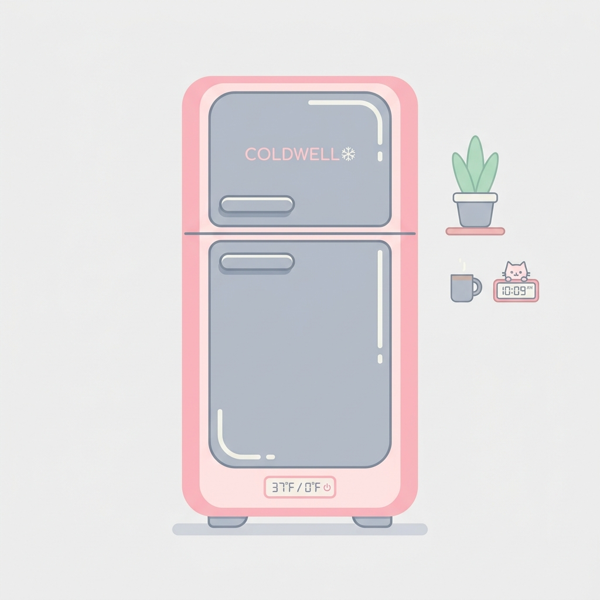
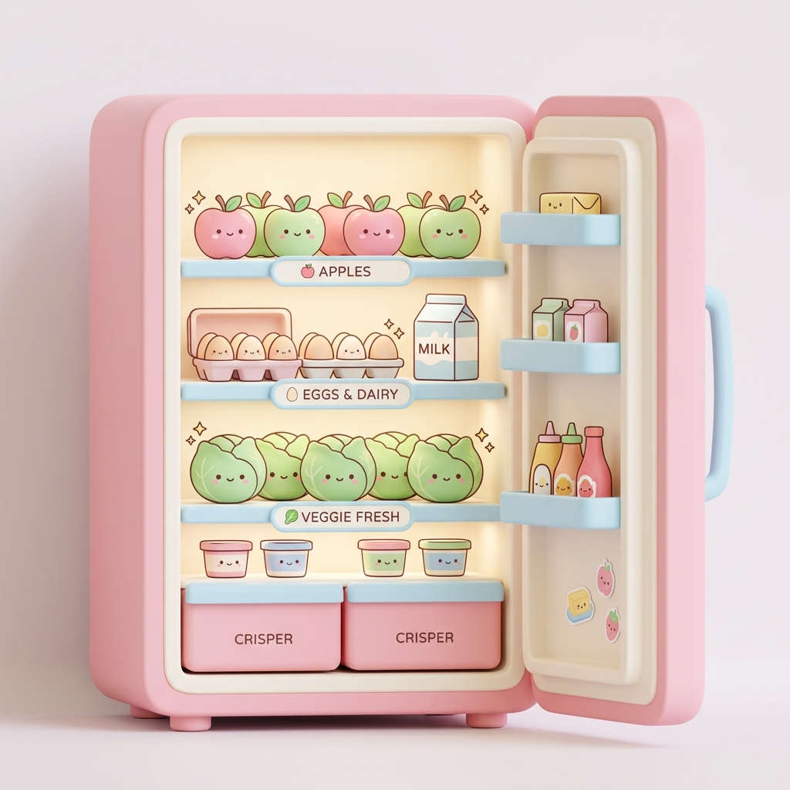
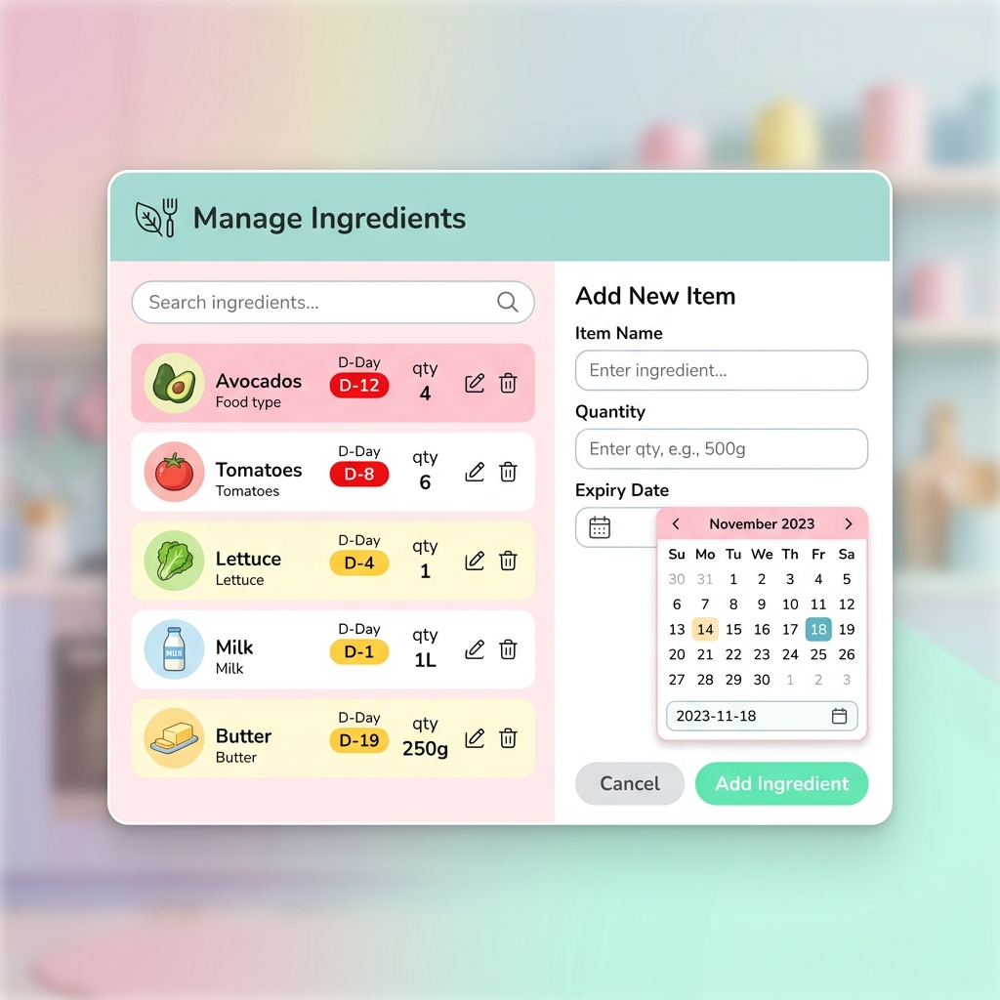
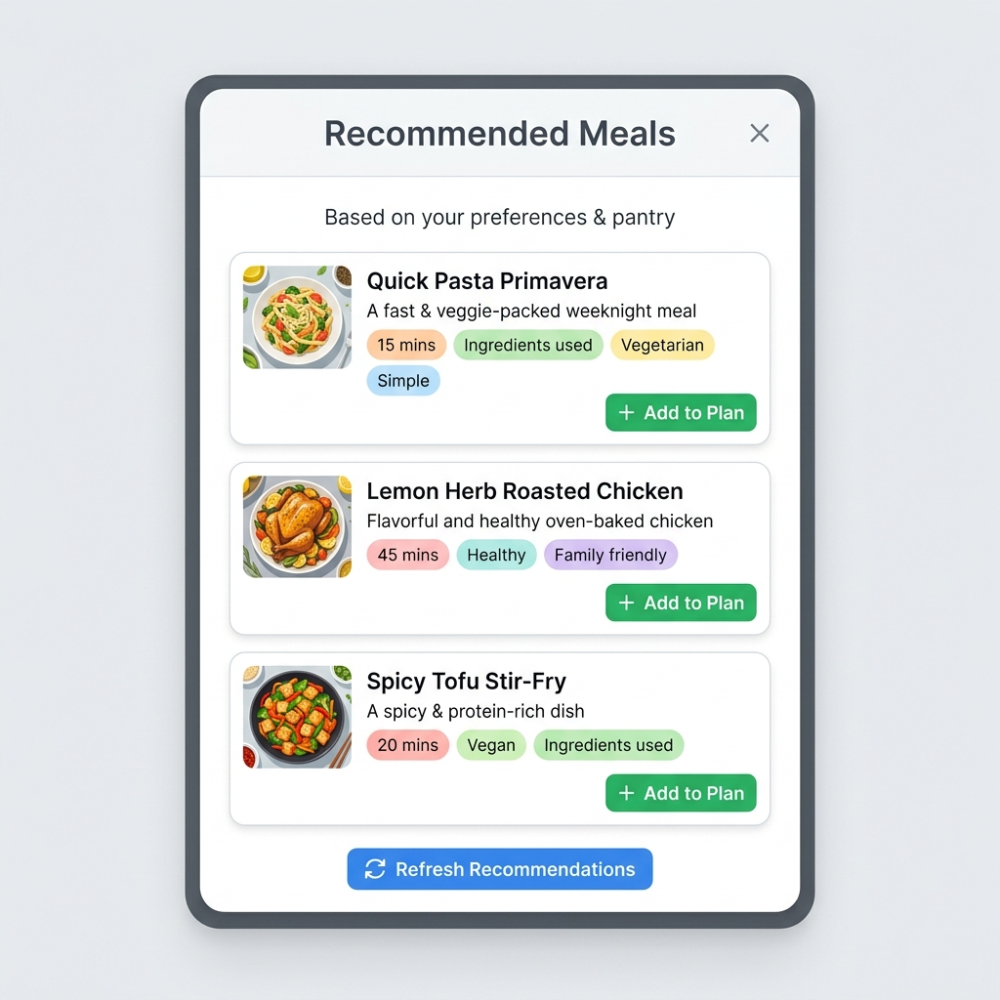

# 🧊 My Smart Fridge (나만의 스마트 냉장고)

귀엽고 입체적인 3D 냉장고 UI와 스마트한 식단 추천 기능이 탑재된 냉장고 관리 웹 애플리케이션입니다! 🍎🥦

<p align="center">
  
</p>

## ✨ 주요 기능 및 화면

### 1. 인터랙티브 3D 냉장고 오픈
* 메인 화면의 냉장실 또는 냉동실 문을 클릭하면 CSS 3D Transform을 이용해 부드럽게 문이 열리는 애니메이션이 나옵니다.
* 문이 열리면 내부의 선반과 야채칸에 귀여운 파스텔 톤 일러스트 식재료 아이콘들이 입체감 있게 디스플레이됩니다.

<p align="center">
  
</p>

### 2. 식재료 및 유통기한 관리
* 냉장고 문이 열린 뒤 나타나는 모달 창에서 보관 중인 식재료를 직관적으로 관리할 수 있습니다.
* 유통기한을 캘린더에서 직접 입력하고, 3일 이내로 남은 식재료는 **🚨 D-Day 배지**를 통해 붉은색으로 강조 표시해 줍니다.
* 식재료의 이름과 날짜를 인라인 에디터 기능(수정 버튼)으로 손쉽게 변경하거나 삭제할 수 있습니다.

<p align="center">
  
</p>

### 3. 스마트 식단 추천 (냉장고 파먹기)
* 우측 하단의 요리사 모자 아이콘을 누르면 **스마트 식단 도우미**가 실행됩니다.
* 현재 냉장고와 냉동실에 등록되어 있는 실제 식재료 데이터들을 기반으로, 만들 수 있는 맞춤형 요리를 한 번에 3개씩 자동 추천합니다.
* 마음에 드는 요리가 없을 경우 `다른 추천 받기` 버튼을 눌러 새로고침(교체)할 수 있으며, 추천 리스트 중 마음에 들지 않는 요리만 `X` 버튼을 눌러 개별 삭제할 수 있습니다.
* **상세 레시피:** 각 추천 요리 카드의 `[레시피 보기 🔽]` 버튼을 누르면 정확한 조리 시간과 분/초 단위의 구체적인 단계별 레시피가 펼쳐집니다.

<p align="center">
  
</p>

## 🛠️ 기술 스택

* **Frontend:** React (Hooks, State Management), Vite
* **Styling:** Vanilla CSS (Custom Properties, Flexbox/Grid, Keyframe Animations, 3D Perspective)
* **Icons:** Lucide-React

## 🚀 로컬에서 시작하기

프로젝트를 로컬 환경에서 실행하려면 아래 명령어를 순서대로 입력하세요.

```bash
# 1. 저장소 클론
git clone https://github.com/kimty115/app_fridge.git

# 2. 프로젝트 폴더로 이동
cd app_fridge

# 3. 의존성 패키지 설치
npm install

# 4. 개발 서버 실행
npm run dev
```

## 🤝 기여 및 피드백
버그 리포트나 재미있는 기능 제안은 언제든 환영합니다! Issue를 남겨주시거나 Pull Request를 보내주세요.
